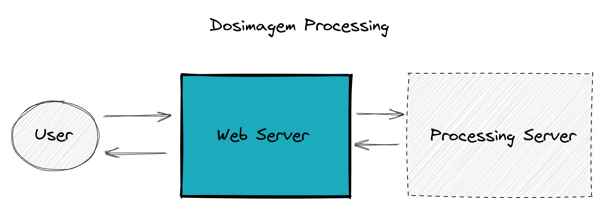

# Especificação

## Modelos do sistema

### 1. Usuário

Usuário é toda pessoa física que interage com a plataforma. Estes podem ser anônimos ou registrados. Somente usuários registrados podem realizar solicitações de serviços e somente estes podem solicitar serviços. 

Atributos do modelo: 

- Nome 
- E-mail 
- Telefone
- Instituição
- Cargo

### 2. Serviço

Serviços são as opções de consumo que o usuário possui na plataforma.

Atributos do modelo: 

- **Solicitante: Usuário** que realizou a solicitação do serviço 
- **Data da solicitação:** Data em que a solicitação foi realizada 
- **Data de conclusão:** Data em que a solicitação foi concluída 
- **Status:** [ Aguardando pagamento ; Aguardando processamento ; Processando ; Concluído ]
- **Tipo de serviço:** [ Dosimetria clínica; Dosimetria pré-clínica ; Segmentação,  Radiosinoviorteses ; Modelagem Computacional ] 
- **Preço:** Valor cobrado pelo serviço
- **Link para o relatório:** URL para o relatório da solicitação
- **Informações técnicas:** Toda informação necessária para a geração do relatório. Específico ao tipo do serviço

#### Parâmetros necessários para cada tipo de serviço

- **Dosimetria clínica:** Conjunto de imagens, Fator de câmera, Radionuclídeo, Atividade injetada, Tempo de injeção
- **Dosimetria pré-clínica:** Conjunto de imagens, Fator de câmera, Radionuclídeo, Atividade injetada, Tempo de injeção
- **Segmentação e Radiosinoviorteses:** Imagem, Observações(Texto)
- **Modelagem Computacional:** Imagem, especificação do equipamento [Opções: CT, SPECT]

### 3. Modelagem do banco de dados

## 4. Funcionalidades 

Estas são as ações que um usuário poderá realizar na plataforma. 

### 4.1. Registro de usuário 
Os usuários anônimos devem ser capazes de se registrarem na plataforma. 

### 4.2. Login de usuário 
Um usuário registrado deve ser capaz de logar na plataforma. 

### 4.3. Painel do usuário 
Neste painel o usuário é capaz de acompanhar todas as suas solicitações. Somente usuários logados são capazes de acessar esta funcionalidade.

### 4.4. Solicitação de serviço

Cada um dos 4 tipos de serviço poderá ser solicitado na plataforma. Todo serviço solicitado necessita de dados específicos para ser realizado.( Ver seção 'Parâmetros necessários para cada tipo de serviço' )

Logo após a submissão do formulário com os dados específicos da solicitação de serviço, as instruções de pagamento serão exibidas.

*Somente usuários logados são capazes de acessar esta funcionalidade.

### 4.5. Pagamento do serviço

O pagamento do serviço será feito através da transferência direta para a conta da empresa via TED ou PIX. 
